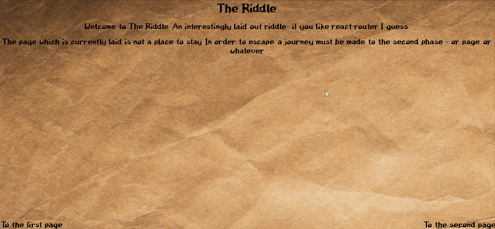

This project was bootstrapped with [Create React App](https://github.com/facebook/create-react-app).

This is a React app I made to try and wrap my head around the react-router-api. It uses `<BrowserRouter/>`, `<Route/>`, `<Switch/>` and 
`<Link/>`. There are three routes that make up the app - `<FirstPage/>`, `<HomePage/>` and `<SecondPage/>`. The app was designed a simple riddle that's meant to give the user a feeling of an old dusty book. In order to solve the riddle, users must traverse to the page with the riddle on it, and then travel to the page where they can enter the answer to that riddle!

